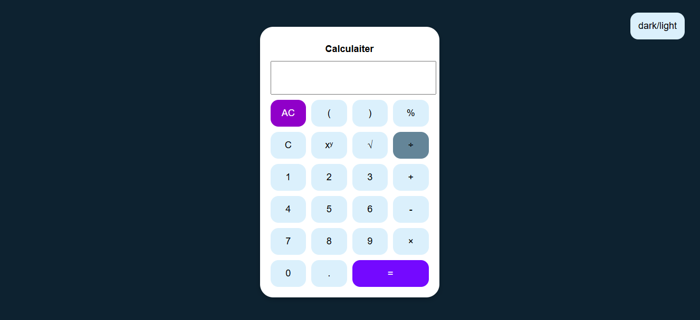

# Php Calculator  

## 📖 Description  
A simple non-scientific calculator built with **PHP, HTML, CSS, and JavaScript**.  
It is designed for performing basic operations like addition, subtraction, multiplication, and division.  
This project was mainly created as a practice tool for learning PHP and front-end integration.  

---

## ✨ Features  
- Perform basic arithmetic operations (+, −, ×, ÷)  
- Square root (`√`)  
- Percentage (`%`)  
- Power (`xʸ`)  
- Clear all (AC)  
- Clear last digit (C)  

---

## 🚀 How to Run  
1. Clone or download the project.  
2. Place the folder inside:  
   - `xampp/htdocs` (if you are using **XAMPP**)  
   - `wamp/www` (if you are using **WAMP**)  
3. Start Apache server.  
4. Open your browser and go to:  
     http://localhost/your-folder-name

---

## 🛠️ Technologies Used  
- PHP  
- HTML  
- CSS  
- JavaScript  

---

## 📸 Screenshot  
  

---

## 💡 Future Ideas  
- Add **keyboard support** for faster input.  
- Extend it into a **scientific calculator** with advanced math functions.  
